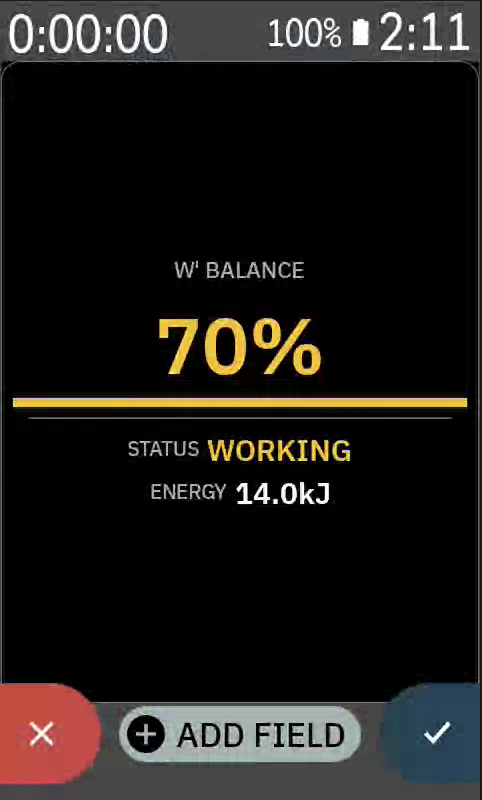
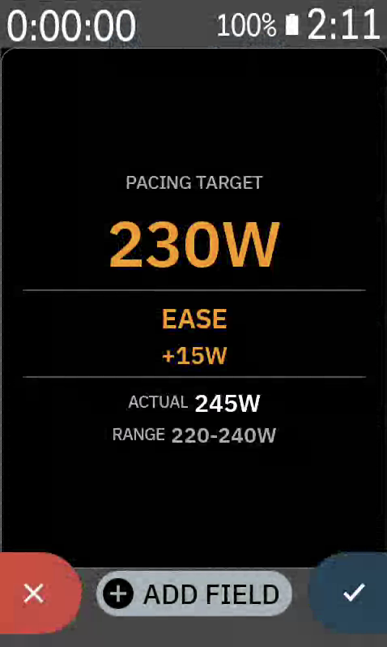
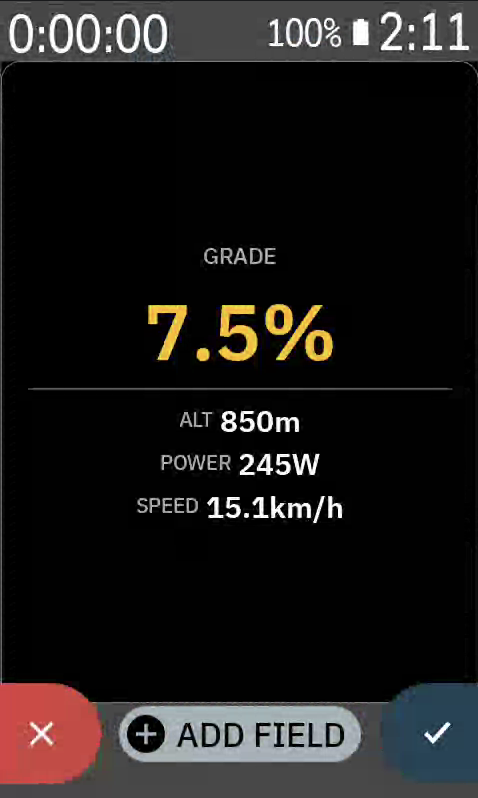
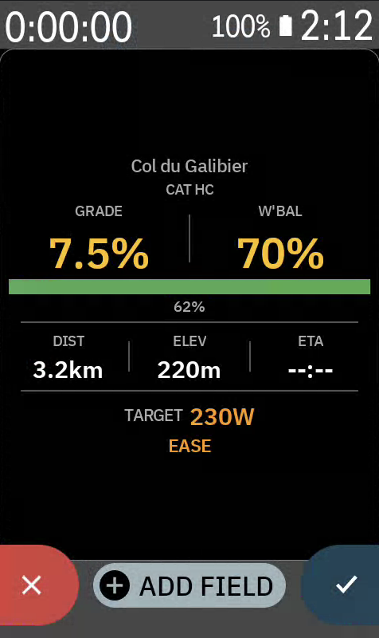
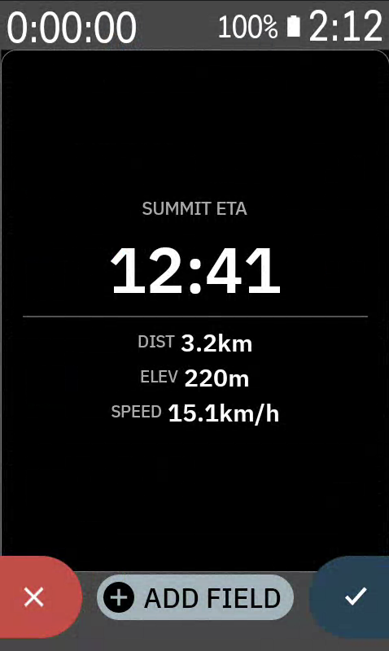
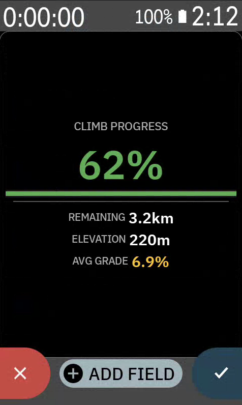
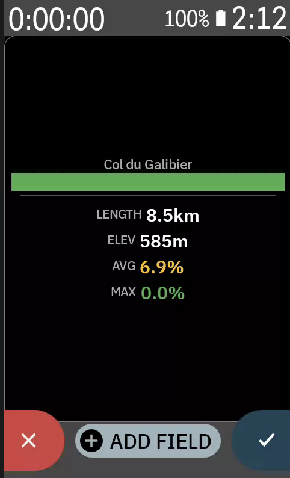
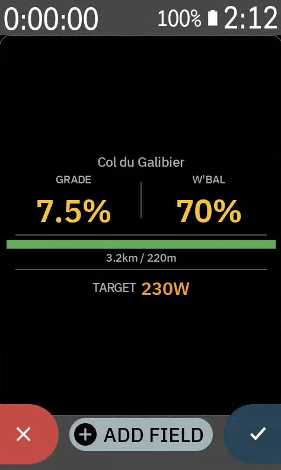
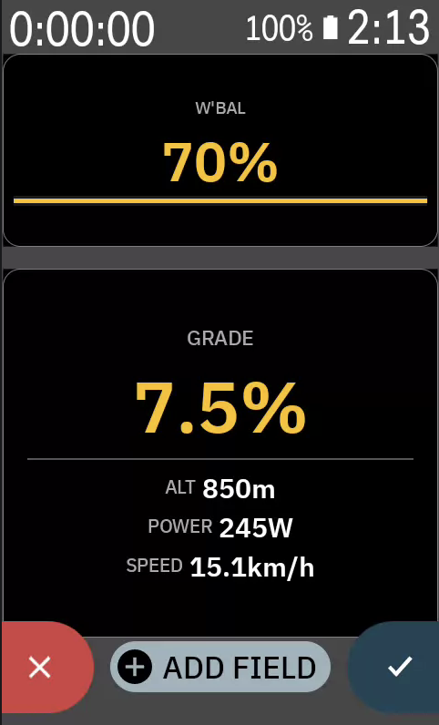
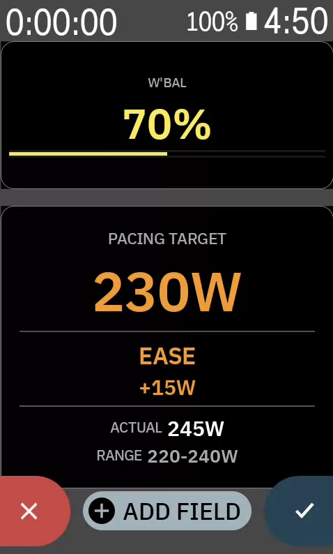

# 7Climb

Real-time climb intelligence for Hammerhead Karoo.

[](LICENSE)
[](https://www.hammerhead.io/)
[](https://github.com/yrkan/7climb/releases)
[](https://github.com/yrkan/7climb/releases/latest)
[](https://7climb.com)

## What it does

W' Balance tracking, physics-based pacing, automatic climb detection, and PR comparison — all updating at 1Hz on your Karoo screen.

**Know exactly when to push and when to save.**

## Screenshots

| W' Balance | Pacing Target | Grade | Climb Overview |
|:---:|:---:|:---:|:---:|
|  |  |  |  |

| Summit ETA | Climb Progress | Climb Profile | Compact Climb |
|:---:|:---:|:---:|:---:|
|  |  |  |  |

| Multi-field layout | Multi-field layout |
|:---:|:---:|
|  |  |

## Features

| Feature | Description |
|---------|-------------|
| **W' Balance** | Skiba differential model. 6 status levels, depletion gauge, time-to-empty/full |
| **Pacing Engine** | Physics-based target power (gravity + aero + rolling resistance + altitude) |
| **Climb Detection** | Auto-detects climbs from gradient when no route is loaded |
| **PR Tracking** | GPS-matched climb history with live time delta comparison |
| **Alerts** | W' critical, steep ahead, summit approaching, new PR — with sound/vibration |
| **FIT Recording** | Custom developer fields: W' balance, pacing status, target power, PR delta |

## Data Fields

9 specialized data fields, each supporting 6 layout sizes:

- **W' Balance** — anaerobic capacity gauge with status
- **Pacing Target** — target watts with PUSH/EASE/STEADY/PERFECT advice
- **Grade** — current gradient, color-coded
- **Climb Overview** — compound view with W', pacing, profile, ETA
- **Summit ETA** — time remaining to top
- **Climb Progress** — distance and elevation remaining
- **Climb Profile** — gradient-colored elevation profile with position marker
- **Next Segment** — upcoming 100m gradient preview
- **Compact Climb** — grade + W'% for small slots

## The Science

W' Balance uses the Skiba differential model:

```
if P > CP:  dW' = (W'max - W') / τ - (P - CP) × dt
if P ≤ CP:  dW' = (W'max - W') / τ × dt
```

Pacing uses full physics:

```
F_gravity = m × g × sin(atan(grade))
F_rolling = m × g × Crr × cos(atan(grade))
F_aero    = 0.5 × ρ × CdA × v²
ρ         = 1.225 × exp(-0.0001185 × altitude)
```

## Requirements

- Hammerhead Karoo 2 or Karoo 3
- Power meter (required for W' Balance and pacing)
- FTP and weight configured in app settings

## Install

1. Download `7climb.apk` from [Releases](https://github.com/yrkan/7climb/releases)
2. Sideload to Karoo via USB/ADB:
   ```
   adb install 7climb.apk
   ```
3. Open 7Climb on Karoo, enter FTP and weight
4. Add data fields to your ride profile

## Build from source

```bash
# Clone
git clone https://github.com/yrkan/7climb.git
cd 7climb

# Set GitHub Packages credentials (for karoo-ext SDK)
# Add to ~/.gradle/gradle.properties:
#   gpr.user=YOUR_GITHUB_USERNAME
#   gpr.key=YOUR_GITHUB_TOKEN

# Build
export ANDROID_HOME=~/Library/Android/sdk
export JAVA_HOME="/Applications/Android Studio.app/Contents/jbr/Contents/Home"
./gradlew assembleDebug

# APK at: app/build/outputs/apk/debug/7climb.apk
```

## Tech Stack

- **Language:** Kotlin 2.2.20
- **SDK:** Karoo Extension SDK 1.1.7 (karoo-ext)
- **UI:** Jetpack Compose + Glance (RemoteViews for data fields)
- **Persistence:** Room (climb history), DataStore (preferences)
- **Build:** AGP 8.13.2, KSP, Gradle 8.13

## Project Structure

```
app/src/main/kotlin/io/github/climbintelligence/
├── ClimbIntelligenceExtension.kt   # KarooExtension service
├── BootReceiver.kt                 # Auto-start on boot
├── MainActivity.kt                 # Settings UI
├── engine/                         # Business logic
│   ├── ClimbDataService.kt         # Sensor stream aggregation
│   ├── WPrimeEngine.kt             # W' Balance calculation
│   ├── PacingCalculator.kt         # Physics-based pacing
│   ├── ClimbDetector.kt            # Auto climb detection
│   ├── PRComparisonEngine.kt       # PR tracking
│   ├── TacticalAnalyzer.kt         # Segment-aware tactical insights
│   ├── AlertManager.kt             # InRideAlert dispatch
│   ├── RideStateMonitor.kt         # Ride lifecycle
│   └── CheckpointManager.kt       # Crash recovery
├── datatypes/                      # 9 Karoo data fields
│   ├── glance/                     # Glance UI components
│   └── fit/                        # FIT file recording
├── data/                           # Persistence layer
│   ├── database/                   # Room DB
│   └── model/                      # Domain models
├── util/                            # Physics, elevation decoding
└── ui/                             # Compose settings screens
```

## Privacy

All data stays on your Karoo device. No cloud, no account, no telemetry.

## License

MIT
